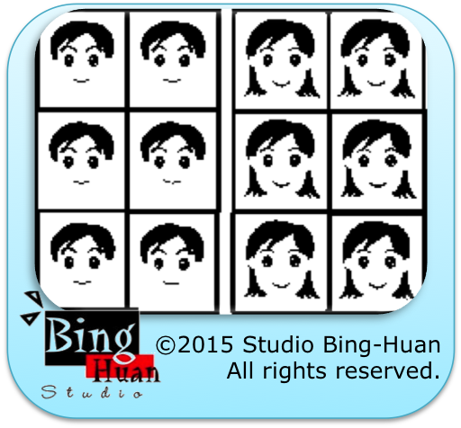

=======
# Photo Booth

## Project: Photo Booth.

My blog: <a href="http://studiobinghuan.blogspot.tw/2015/01/photo-booth-finder.html?view=flipcard">http://studiobinghuan.blogspot.tw/2015/01/photo-booth-finder.html?view=flipcard</a> 

Link to launch the web app <a href="http://binghuan.github.io/photobooth/">http://binghuan.github.io/photobooth/</a> 

### How to setup project
#### Install all nodejs packages locally.
npm install

#### Build project
webpack
